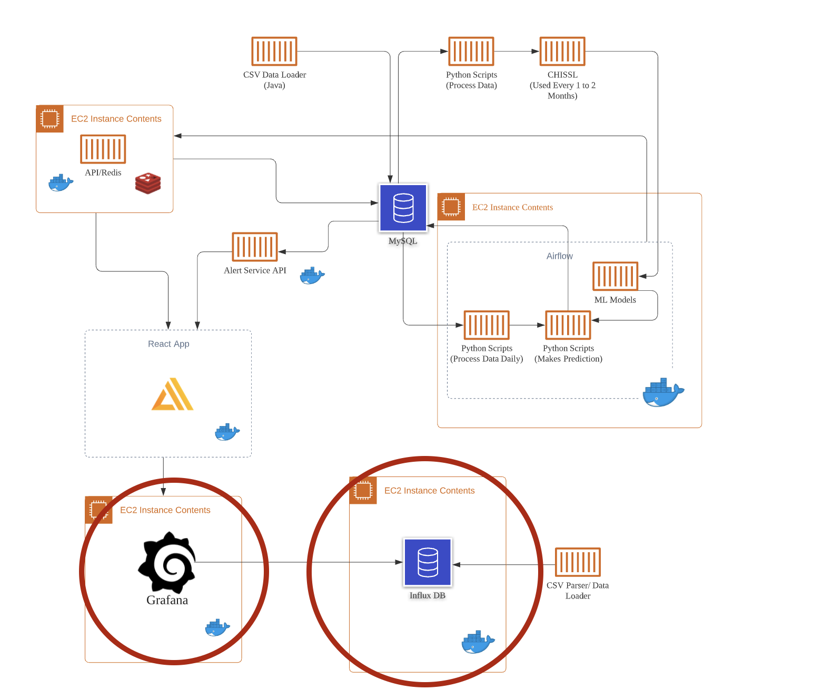
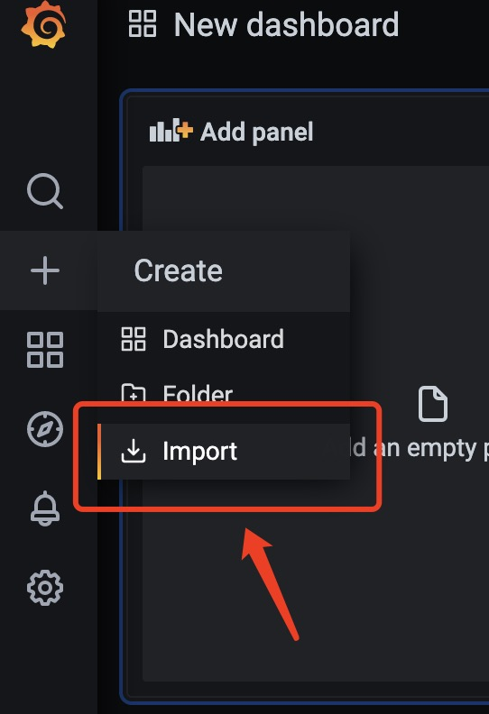
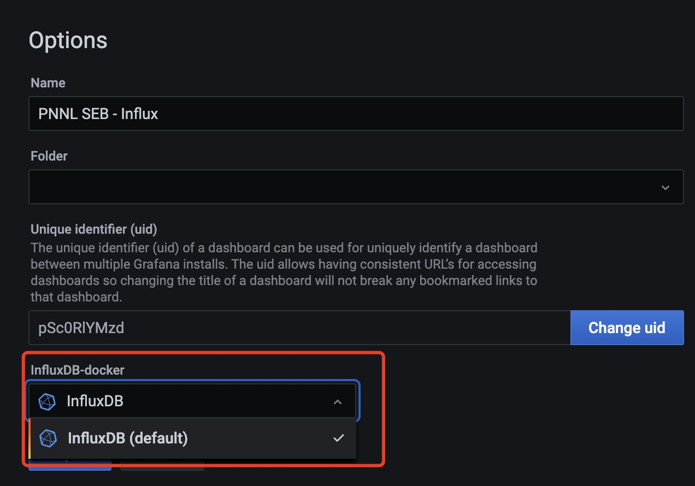

# grafana-services

The grafana services repo contains necessary grafana files and the influxdb container in order to run the Grafana Dashboards that show the live simulated data on the SEB building.

Below is an illustration of where these components fit within the system design:  

The root directory of the project contains a bash script `service_init` that launches containers of Grafana dashboard and its dependency -- influxdb.

# How to use it?

Make sure a docker is installed and running on your machine. `cd ./grafana-services` and then `./service_init.sh`. An influxDB container will be up and running on your machine. Please use the default port: `8086`. You can access the Grafana dashboard via `localhost:3000`

# What does the script do?

Basically, it downloads an influxDB docker image and launch its container. Then it will import the data inside `db_snapshot` directory. Meanwhile, it creates the Grafana container with an initialization script.

# Data source?

When adding the data source for Grafana, use `my_influxdb:8086` as the URL (The host name must be consistent with the container name of the influxDB). For Database under InfluxDB details, use `cs6510`.

# Dashboard quick launch

1. go to `localhost:3000`
2. click on `import`
   
3. upload the Json file `./grafana/GrafanaJSON.json`
4. select the influxdb data source you specified in previous steps
   
5. Done

# More about Grafana

See this [doc](./grafana/README.md)
