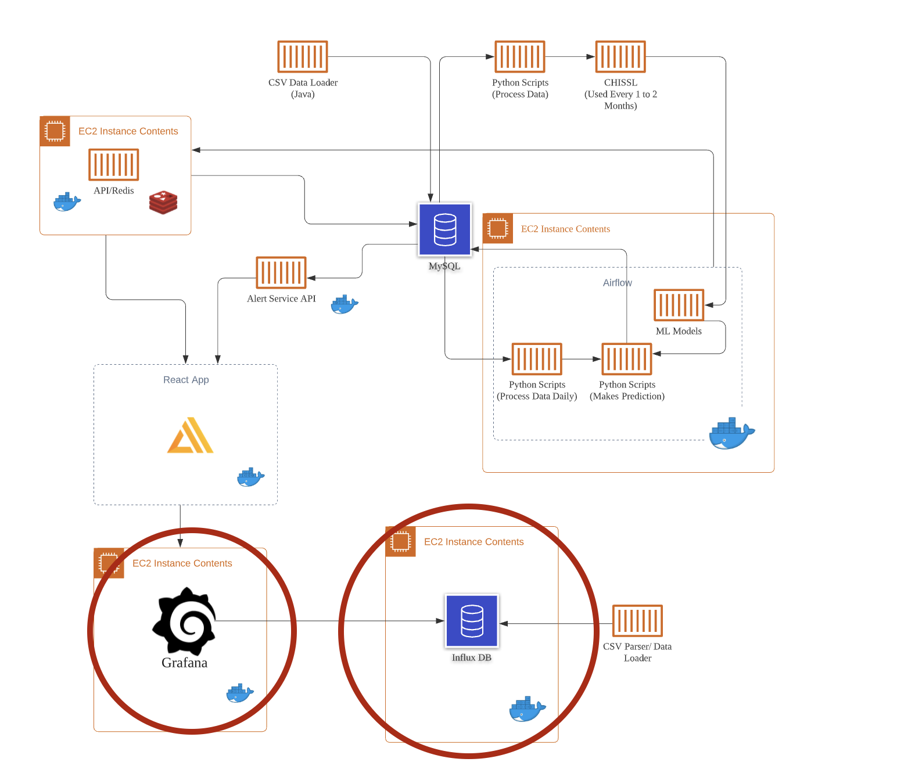

# grafana-services
The grafana services repo contains necessary grafana files and the influxdb container in order to run the Grafana Dashboards that shoe the live simulated data on the SEB building.

Below is an illustration of where these components fit within the system design:  

