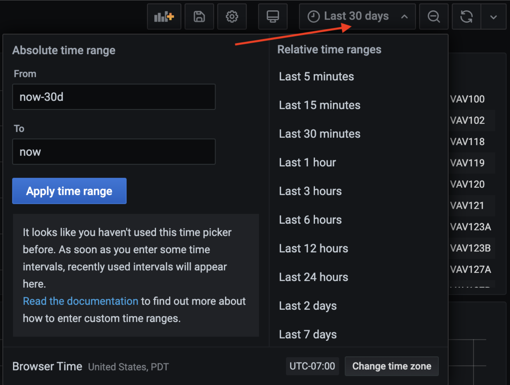
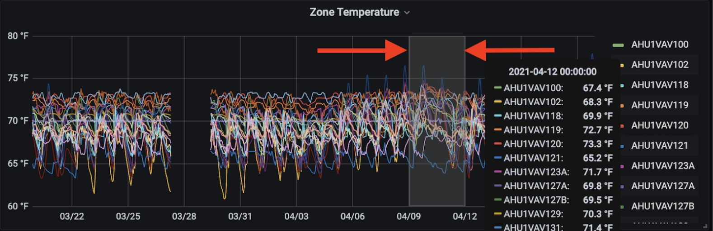
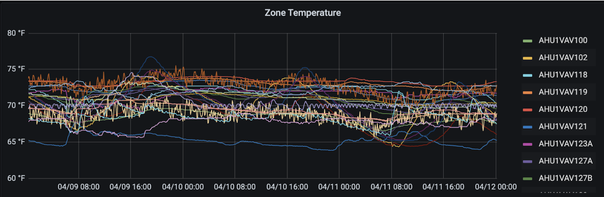
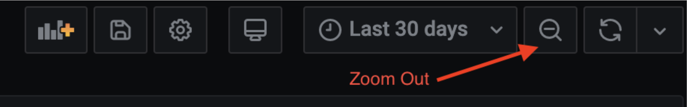
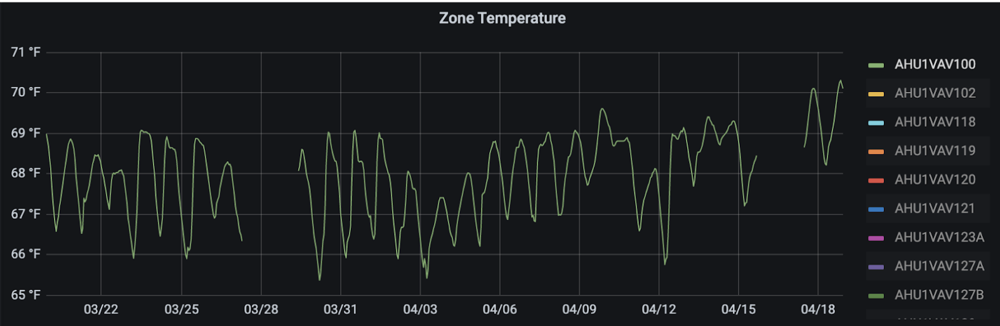
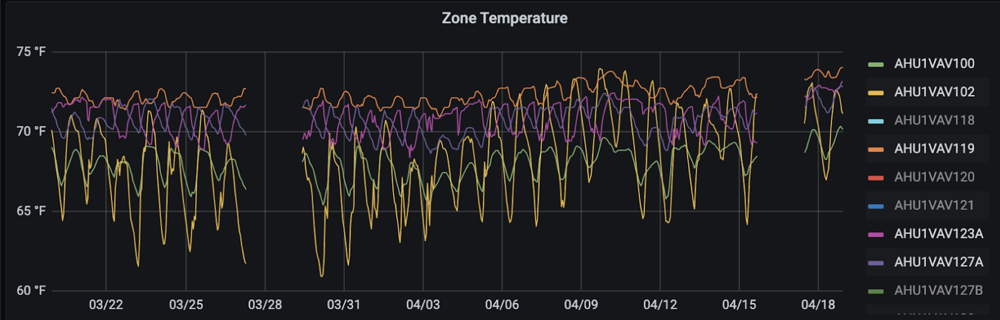
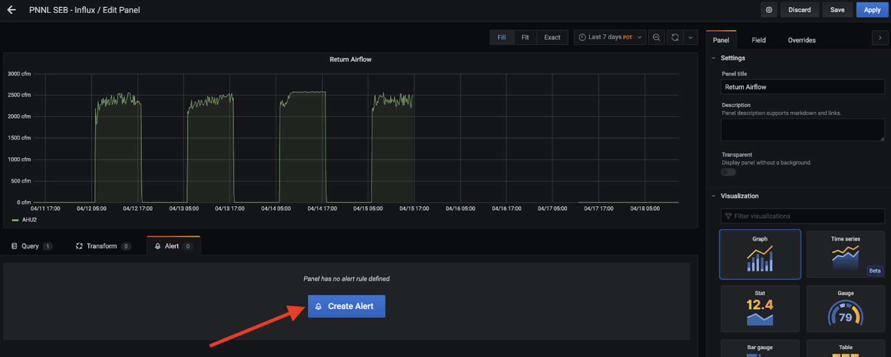
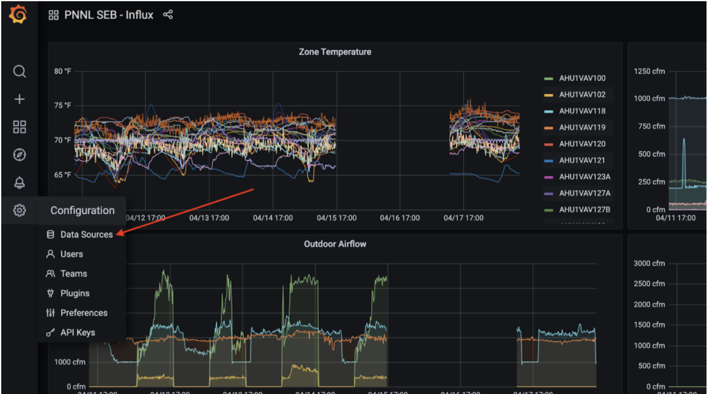

# Grafana Dashboards

## Overview

Grafana dashboard consists of eight separate panels across the following monitoring metrics: zone temperature, zone airflow, outdoor airflow, return airflow, discharge airflow, supply airflow, exhaust airflow, cooling consumption and heating consumption. InfluxDB is used as the main datasource in Grafana. The original CSV file of SEB is formatted as more elegant and organized time-series data and imported into an instance of InfluxDB to significantly improve the query performance. With the ability to get data in and out in a timely manner, Grafana is capable of displaying SEB data in a time range up to past 2 years without a noticeable impact on performance, and it is also capable of displaying data from the past 5 years with a slight performance degradation. Grafana service in this project has also been configured to support alerting through email, yet the feature is only limited to static thresholds. As a result, the current state of alerting is solely deployed on React app instead of Grafana dashboard. Nonetheless, the built-in alerting feature is at a ready-to-go state with a simple setup and minimum upkeep for future use.

## Grafana Instructions
Official documentation can be found [here](https://grafana.com/docs/). 
## Change time range
### Dashboard Level
Current selected time range is located on the upper right corner of the main dashboard. To switch to a different time range, click the drop down menu and select the desired time range or enter a custom time range on the left of the drop down menu.

### Panel Level
Grafana also supports zoom in the time ranges of the data of any specific panel. On any panel that you would like to zoom in, click and drag to select the time range. In the following example, the first screenshot shows that the time range of the Zoom Temperature panel is selected from 04/09 to 04/12, and the second screenshot shows the result panel.

**Note:** To zoom out for a larger time range, click the Zoom out  icon on the upper right of the screen. 

## Select multiple devices/series
To compare multiple devices on the same panel, let’s use the Zoom Temperature panel to give an example. First, on the graph legend, click on the first desired device (AHU1VAV100 in the screenshot). You should see the rest of the devices are grayed out.

 
Then while holding down the COMMAND or CONTROL key, click on the other comparing devices. 

**Note:** It might be easier to make the graph larger for better comparison by clicking the panel name and then select View from the dropdown.

## Setup an alert

Click on the desired panel and select Edit, in this example, “Return Airflow” panel is used. On the following page, select Alert tab underneath the graph. Then click on Create Alert.

Follow the instructions [here](https://grafana.com/docs/grafana/latest/alerting/create-alerts/) to set up your alert as you would in Grafana cloud. 

**Note:** The Grafana service in this project is hosted on our own server instead of hosted on Grafana Cloud. However, the alerting feature is configured to match the same user experience you would have on Grafana cloud except that only email notification is enabled 

## Add a datasource

To add another datasource, on the left sidebar of the main dashboard, click on the Setting icon, select Data Sources from the menu. Follow the instructions [here](https://grafana.com/docs/grafana/latest/datasources/) to configure the desired type of datasource. 

**Note:** The setting icon is only available to an admin role. However, the Grafana service in this project is expected to be used internally with IP address restrictions, thus Grafana service has enabled anonymous access which all users will be recognized as Admin role by default. 

